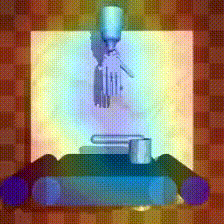
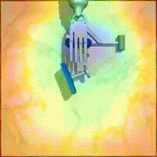
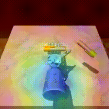
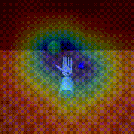
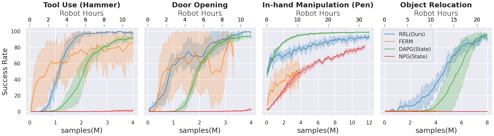

<!-- Copyright (c) Rutav Shah, Indian Institute of Technlogy Kharagpur  -->
<!-- Copyright (c) Facebook, Inc. and its affiliates -->
# RRL: Resnet as representation for Reinforcement Learning
## Quick Links
[Website](https://sites.google.com/view/abstractions4rl)   |   [Paper](https://arxiv.org/abs/2107.03380)   |   [Video](https://youtu.be/Yj1EHvGWmRA)
## Setup
`RRL` codebase can be installed by cloning this repository. Note that it uses git submodules to resolve dependencies. Please follow the steps as below to install correctly.

1. Clone this repository along with the submodules
    ```
    git clone --recursive https://github.com/facebookresearch/RRL.git
    ```
2. Install the package using `conda`. The dependencies (apart from `mujoco_py`) are listed in `env.yml`
    ```
    conda env create -f env.yml

    conda activate rrl
    ```
3. The environment require MuJoCo as a dependency. You may need to obtain a license and follow the setup instructions for mujoco_py. Setting up mujoco_py with GPU support is highly recommended.

4. Install `mj_envs` and `mjrl` repositories.
    ```
    cd RRL
    pip install -e mjrl/.
    pip install -e mj_envs/.
    pip install -e .
    ```
5. Additionally, it requires the demonstrations published by [`hand_dapg`](https://github.com/aravindr93/hand_dapg/)

## Running Instructions
1. First step is to convert the observations of demonstrations provided by [`hand_dapg`](https://github.com/aravindr93/hand_dapg/) to the encoder feature space. An example script is provided [here](https://github.com/facebookresearch/RRL/blob/main/examples/convertDemos.py). **Note** the script saves the demonstrations in a `.pickle` format inside the `rrl/demonstrations` directory.

    For the `mj_envs` tasks :
    ```
    python convertDemos.py --env_name hammer-v0 --encoder_type resnet34 -c top -d <path-to-the-demo-file>
    ```
    ```
    python convertDemos.py --env_name door-v0 --encoder_type resnet34 -c top -d <path-to-the-demo-file>
    ```
    ```
    python convertDemos.py --env_name pen-v0 --encoder_type resnet34 -c vil_camera -d <path-to-the-demo-file>
    ```
    ```
    python convertDemos.py --env_name relocate-v0 --encoder_type resnet34 -c cam1 -c cam2 -c cam3 -d <path-to-the-demo-file>
    ```
2. Launching `RRL` experiments using [DAPG](https://sites.google.com/view/deeprl-dexterous-manipulation).

     An example launching script is provided [`job_script.py`](https://github.com/facebookresearch/RRL/blob/main/examples/job_script.py) in the `examples/` directory and the configs used are stored in the `examples/config/` directory. **Note** : Hydra configs are used.
    ```
    python job_script.py  demo_file=<path-to-new-demo-file> --config-name hammer_dapg
    ```
    ```
    python job_script.py  demo_file=<path-to-new-demo-file> --config-name door_dapg
    ```
    ```
    python job_script.py  demo_file=<path-to-new-demo-file> --config-name pen_dapg
    ```
    ```
    python job_script.py  demo_file=<path-to-new-demo-file> --config-name relocate_dapg
    ```
## Results

  ### Tasks
  Leveraging resnet features, RRL delivers natural human like behaviors trained directly form proprioceptive inputs. Presented below are behaviors acquired on ADROIT manipulation benchmark task suite rendered from the camera viewpoint. We also overlay the visual features (layer-4 of Resnet model of the top 1 class using GradCAM) to highlight the features RRL is attending to during the task execution. Even though standard image classification models aren't trained with robot images, we emphasize that the features they acquire, by training on large corpus of real world scenes, remain relevant for robotics tasks that are representative of real  world and rich in depth perspective (even in simulated scenes).

<table cellspacing="0" style="width:300px;height:300px;border:1px solid black;">
   <tr>
     <td style="text-align:center;">
       
     
     
     
     </td>
   </tr>
</table>

  ### Performance

  Compared to baselines, which often fail and are sensitive to hyper-parameters, RRL demonstrates relatively stable and monotonic performance; often matching the efficiency of state based methods. We present comparisons with methods that learn directly from state (oracle) as well as ones that uses proprioceptive visual inputs.

  

  1. NPG(State) : State of the art policy gradient method struggles to solve the suite even with privileged low level state information, establishing the difficulty of the suite.

  2. DAPG(State) : A demonstration accelerated method using privileged state information, can be considered as an oracle of our method.

  3. RRL(Ours) : Demonstrates stable performance and approaches performance of DAPG(State).

  4. FERM : A competing baseline; shows good initial, but unstable, progress in a few tasks and often saturates in performance before exhausting our computational budget (40 hours/ task/ seed).
